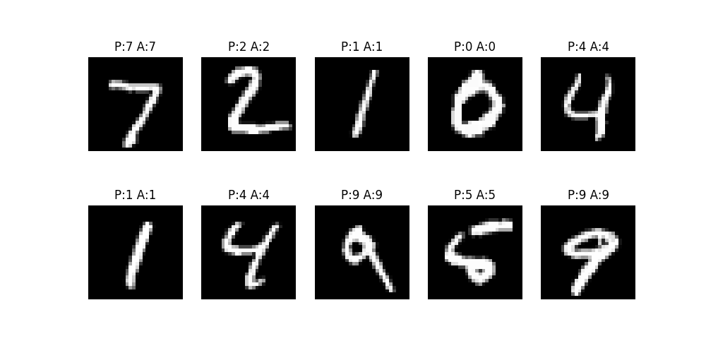

# MNIST Handwritten Digit Recognition

This is my first neural network project using TensorFlow/Keras, where I built a model to recognise handwritten digits (0–9). The model achieves **97.56% accuracy** on the test set — a solid starting point for my deep learning journey!

---

## How to Run

​```bash
pip install tensorflow numpy matplotlib
python neural_network.py
​```

---

## How it Works

A simple feedforward neural network trained on the MNIST dataset:

- **Input layer:** 28×28 grayscale images (flattened to 784 neurons)
- **Hidden layer:** 128 neurons with ReLU activation to learn patterns
- **Output layer:** 10 neurons (one for each digit 0–9)

Training was done on 60,000 images over 5 epochs, allowing the model to gradually improve its predictions.

---


## Libraries Used

- Python
- TensorFlow / Keras
- NumPy
- Matplotlib

---

## Training Results

| Epoch | Accuracy |
|-------|----------|
| 1     | 92.62%   |
| 2     | 96.70%   |
| 3     | 97.69%   |
| 4     | 98.27%   |
| 5     | 98.62%   |

**Final Test Accuracy: 97.56%** (measured on unseen test data)

---

## Model Details

- Loss Function: Categorical Crossentropy  
- Optimizer: Adam  
- Batch Size: 32  
- Epochs: 5  

## Model Architecture

| Layer | Details | Purpose |
|-------|---------|---------|
| Flatten | 28×28 → 784 neurons | Converts 2D image to 1D row |
| Dense (Hidden) | 128 neurons, ReLU | Learns patterns in the data |
| Dense (Output) | 10 neurons, Softmax | Outputs probability per digit |

**ReLU** ignores negative values and keeps positive ones — helps learn complex patterns.

**Softmax** converts output scores to probabilities that add to 100% — highest confidence = prediction.

## Visualisation

After training, the model predicts on 10 test images and displays them with:
- **P:** Predicted digit (what the network thinks)
- **A:** Actual digit (the real answer)

All 10 predictions were correct! ✅



---

## What I Learned

- How neural networks recognise patterns from pixel data
- Neurons, weights and activations
- How training adjusts weights over epochs
- Difference between training accuracy and test accuracy
- Overfitting vs underfitting

---

## Note

Built with guidance from AI assistance (Claude) as part of my self-directed AI/ML learning journey. This is **Week 1 of my 3-month AI/ML project series.**

---

## Learning Resources

- [3Blue1Brown - But what is a neural network?](https://www.youtube.com/watch?v=aircAruvnKk)
  — Best visual explanation of how neural networks work